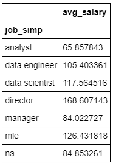
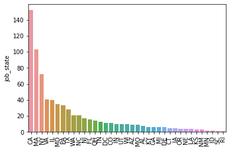

# DS Jobs salary
USA Data Science jobs.

The purpose of this project is to analize the data science jobs salary in Chicago, USA. This project develops a tool that helps people that are looking for a data related job in USA. It estimates the salary (MAE ~ $ 11.5K) depending on the State, skills, age of the enterprise and others.

* Used ~ 1000 job descriptions for organize the data
* Found the features in the job description to quantify the skills
* Linear, Lasso, and Random Forest Regressors using GridsearchCV to reach the best model
* Built a client facing API using flask


The development of this project is guided by ***Ken Jee*** with its YouTube [playlist](https://www.youtube.com/playlist?list=PL2zq7klxX5ASFejJj80ob9ZAnBHdz5O1t)
 "Data Science Project from Scratch", 
and the main idea is to improve my data science skills using a real life problem including its phases (data collection, data cleaning, EDA, model, etc.) from scratch.

## Dataset

There are 1000 jobs related with data science taken from Glassdoor where we have the following columns:

- Job title
- Salary Estimate
- Job Description
- Rating
- Company
- Location
- Company Headquarters
- Company Size
- Company Founded Date
- Type of Ownership
- Industry
- Sector
- Revenue
- Competitors

## Data Cleaning
In order to use the data it was required make changes to make it usable for data analysis and our model, the following changes were applied to the dataset:

* Added columns to indicate the type of salary (hourly, anually) and in case of employer provided
* Removed rows without salary
* Parsed salary to numeric
* Company text only
* Added a new column for company State Location
* Calculated the age of the company
* New column for job title (data scientist, data analyst, etc)
* Added new columns if different tools were listed in the job description:
  * R
  * Python
  * Spark
  * AWS
  * SAS
  * Excel
  * Tableau
  * Tensorflow
  * Scikit-learn

## Exploratory Data Analysis (EDA)

<p align="center">
   
   
</p>

<p align="center">
 
 
</p>

## ML Model
The categorical variables were transformed into dummy variable and the data was splitted into train (80%) and test (20%).

There were three models evualuated using Mean Absolute Error (MAE) because is very common to use:
* **Random Forest**
* **Lasso Regression**
* **Multiple Linear Regression**

## Model performance 
### MAE
* **Multiple Linear:**  12270635.153219618
* **Lasso:**  17.761137299258326
* **Random Forest:** 11.581543624161073

# Productionization and Deployment

In this step, I built a flask API endpoint that was hosted on a local webserver by following along with the TDS tutorial in the reference section above. The API endpoint takes in a request with a list of values from a job listing and returns an estimated salary.


## Code and Resources used

**Ubuntu:** 20.04

**Anaconda version:** 4.9.2

**Python version:** 3.7

**Packages:** pandas, numpy, sklearn, matplotlib, seaborn, selenium, flask, json, pickle

**For Web Framework Requirements:** /flaskAPI/ -> ``` pip install -r requirements.txt ```

**Project step by step:** https://www.youtube.com/playlist?list=PL2zq7klxX5ASFejJj80ob9ZAnBHdz5O1t

**Ken Jee Youtube channel:** https://www.youtube.com/channel/UCiT9RITQ9PW6BhXK0y2jaeg

**Productionize a ML model with Flask:** https://towardsdatascience.com/productionize-a-machine-learning-model-with-flask-and-heroku-8201260503d2
